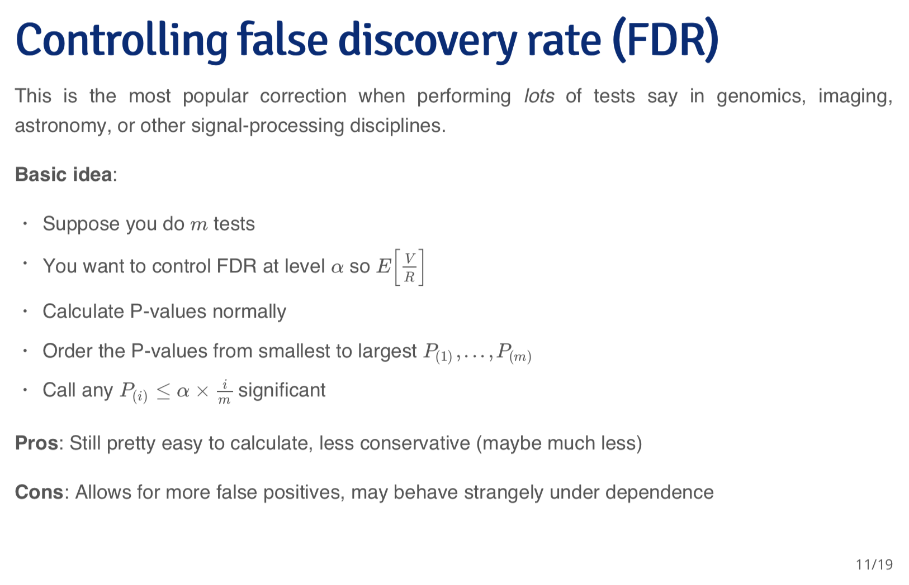

Slide from Coursera(https://www.coursera.org/learn/statistical-inference/lecture/7c7Ns/12-01-multiple-comparisons)
#

Illustration (https://eranraviv.com/understanding-false-discovery-rate/ (In the article it doesn't use set.seed()))
```{r ,tidy=T}
#Generate variables
TT <- 200
pp <- 1000
set.seed(101) #This only needs to be used once although there are multiple rnorm() down below
x <- matrix(nrow= TT, ncol= pp) #dim(x)= 200 1000
for (i in 1:pp){
x[,i] = rnorm(TT) #for each column add 200 normally distributed numbers
}
relevant <- 20
signall <- seq(0.1,1,length.out= relevant)
bet <- c( signall, rep(0, pp- relevant) )
eps <- rnorm(TT)
y = t(t(bet)%*%t(x))+eps # The real unknown model
tvals <- NULL
for (i in 1:pp){
tvals[i] = summary(lm(y~x[,i]))$coef[2,3]
}


#The plot
plot(density(x))
lines(density(tvals),col="blue")
abline(v=c(-2,2),col="red")

#Decide the cutoff
variables_look_interesting <- tvals[ tvals > 2 | tvals < (-2)]
length(variables_look_interesting) #The result from my set.seed(101)

##FDR
(1000/20)/53  

length(tvals[ tvals > 3 | tvals < (-3)]) #FDR= pp* (1-pnorm(3)) * 2/10=0.2699796 (27%)
length(tvals[ tvals > 4 | tvals < (-4)]) #FDR= pp* (1-pnorm(4)) * 2/5=0.0126685 (1%)