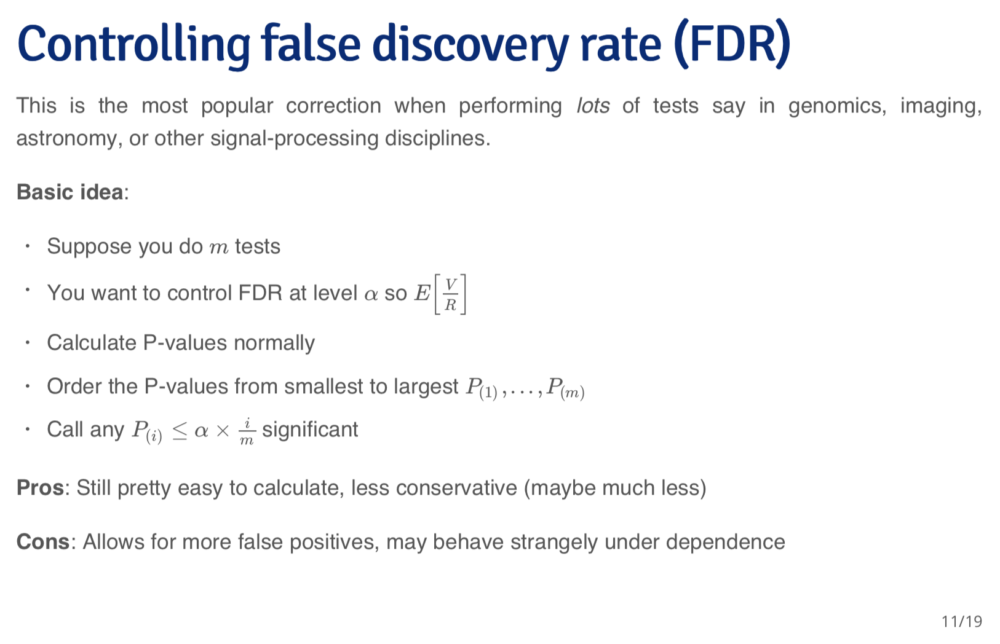
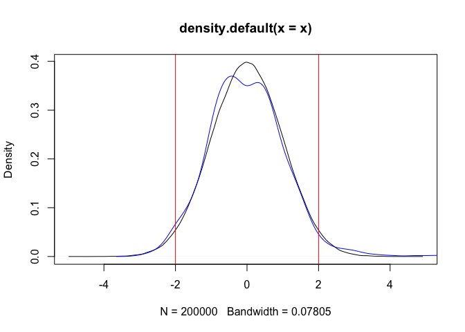

# FDR (False Discovery Rate)
Slide from Coursera(https://www.coursera.org/learn/statistical-inference/lecture/7c7Ns/12-01-multiple-comparisons)
#

Illustration (https://eranraviv.com/understanding-false-discovery-rate/ (In the article it doesn't use set.seed()))

```r
# Generate variables
TT <- 200
pp <- 1000
set.seed(101)  #This only needs to be used once although there are multiple rnorm() down below
x <- matrix(nrow = TT, ncol = pp)  #dim(x)= 200 1000
for (i in 1:pp) {
    x[, i] = rnorm(TT)  #for each column add 200 normally distributed numbers
}
relevant <- 20
signall <- seq(0.1, 1, length.out = relevant)
bet <- c(signall, rep(0, pp - relevant))
eps <- rnorm(TT)
y = t(t(bet) %*% t(x)) + eps  # The real unknown model
tvals <- NULL
for (i in 1:pp) {
    tvals[i] = summary(lm(y ~ x[, i]))$coef[2, 3]
}


# The plot
plot(density(x))
lines(density(tvals), col = "blue")
abline(v = c(-2, 2), col = "red")
```

<!-- -->

```r
# Decide the cutoff
variables_look_interesting <- tvals[tvals > 2 | tvals < (-2)]
length(variables_look_interesting)  #The result from my set.seed(101)
```

```
## [1] 53
```

```r
## FDR
(1000/20)/53
```

```
## [1] 0.9433962
```

```r
length(tvals[tvals > 3 | tvals < (-3)])  #FDR= pp* (1-pnorm(3)) * 2/10=0.2699796 (27%)
```

```
## [1] 10
```

```r
length(tvals[tvals > 4 | tvals < (-4)])  #FDR= pp* (1-pnorm(4)) * 2/5=0.0126685 (1%)
```

```
## [1] 5
```
